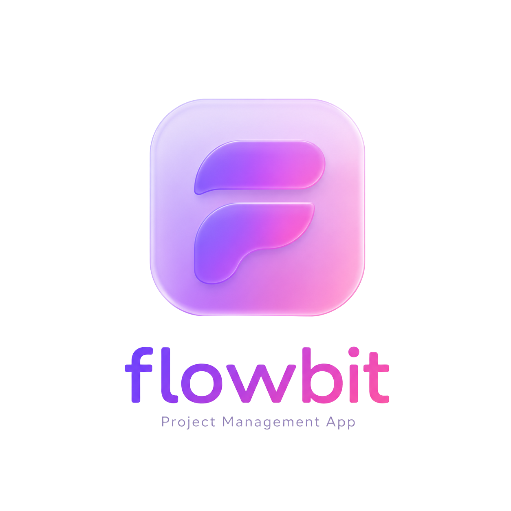

# Flowbit

**Live demo:** https://flowbit-iota.vercel.app

An AI-powered full-stack project management app inspired by Linear and Jira. Built with Next.js, TypeScript, Python, Prisma, and PostgreSQL.

## Features

### Core
- Register and login with secure password hashing (bcrypt)
- Create and manage projects with role-based access (admin/member)
- Invite and remove team members from projects
- Kanban board with 4 columns — Backlog, In Progress, In Review, Done
- Click any task to view, edit, assign, set due dates, or delete
- Drag and drop tasks between columns with optimistic UI updates
- Real-time collaboration — task updates sync instantly across all connected users via WebSockets
- Cross-tab session sync — login/logout reflected instantly across all open tabs

### AI Features
- **AI task suggestions** — Groq LLM analyzes your project and suggests relevant tasks
- **Natural language task creation** — describe what you need in plain English
- **Voice input** — speak your task and AI creates it instantly
- **PDF upload with RAG** — upload any document, AI chunks it, generates embeddings via HuggingFace, retrieves relevant sections via pgvector cosine similarity, then extracts tasks via Groq LLM
- **ML priority prediction** — Random Forest classifier auto-predicts task priority on creation
- **Feedback loop** — user priority corrections stored and used to retrain the model

### Task Management
- Task assignment with member initials shown on cards
- Priority levels (High/Medium/Low) with color-coded badges
- Due dates with smart countdown display (overdue, hours, days)
- Tasks sorted by priority within each column

## Tech Stack

### Frontend
- Next.js 16, React, TypeScript, Tailwind CSS
- TanStack Query, dnd-kit, Socket.io client

### Backend
- Next.js API routes
- Express + Socket.io (WebSocket server)
- NextAuth.js + bcrypt
- Prisma ORM + PostgreSQL

### AI/ML
- Groq API (llama-3.3-70b-versatile)
- Python, scikit-learn, FastAPI
- HuggingFace Inference API (sentence-transformers/all-MiniLM-L6-v2)
- pgvector (PostgreSQL vector extension)
- pdf-parse-fork, Web Speech API

### Infrastructure
- Vercel (Next.js app)
- Neon (PostgreSQL database)
- Render (Socket.io server + FastAPI ML service)
- Docker (local development)

## Architecture
Browser ←→ Next.js on Vercel (REST API + pages)
Browser ←→ Socket.io on Render (real-time WebSockets)
Browser ←→ FastAPI on Render (ML priority prediction)
Next.js ←→ PostgreSQL on Neon (data)

## ML Pipeline

The priority predictor is a Random Forest classifier trained on domain-agnostic task examples:

1. 90 synthetic labeled examples (high/medium/low)
2. TF-IDF feature extraction with bigrams
3. Random Forest with balanced class weights
4. FastAPI endpoint serving predictions
5. User corrections stored in `TrainingFeedback` table
6. Retraining script incorporates feedback automatically