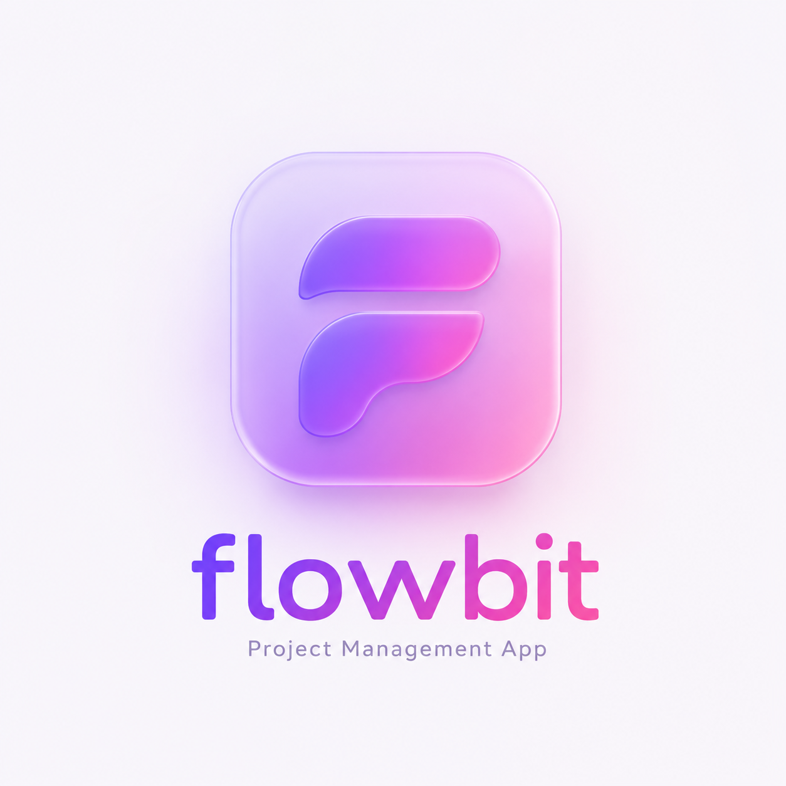

# Flowbit

**Live demo:** https://flowbit-iota.vercel.app

A full-stack project management app inspired by Linear and Jira. Built with Next.js, TypeScript, Prisma, and PostgreSQL.

## Features

- Register and login with secure password hashing (bcrypt)
- Create and manage projects with role-based access (admin/member)
- Invite team members to projects by email
- Kanban board with 4 columns — Backlog, In Progress, In Review, Done
- Click any task to view, edit title/description, or delete
- Drag and drop tasks between columns with optimistic UI updates
- Real-time collaboration — task updates sync instantly across all connected users via WebSockets
- Cross-tab session sync — login/logout reflected instantly across all open tabs
- Route protection — unauthenticated users redirected to login
- Glassmorphism UI

## Tech Stack

- **Frontend:** Next.js 16, React, TypeScript, Tailwind CSS
- **Backend:** Next.js API routes, Express + Socket.io (WebSocket server)
- **Database:** PostgreSQL + Prisma ORM
- **Auth:** NextAuth.js + bcrypt
- **Real-time:** Socket.io
- **Drag and drop:** dnd-kit
- **Data fetching:** TanStack Query
- **Deployment:** Vercel (app) + Neon (database) + Render (WebSocket server)