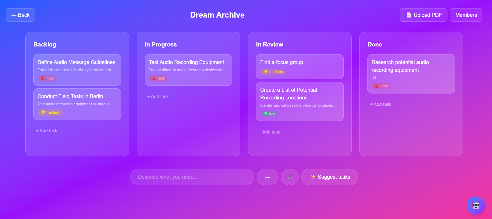
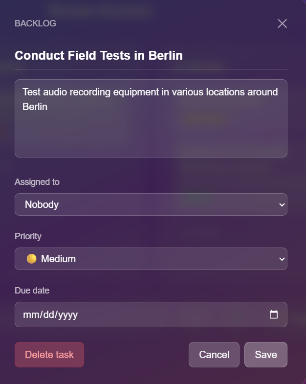
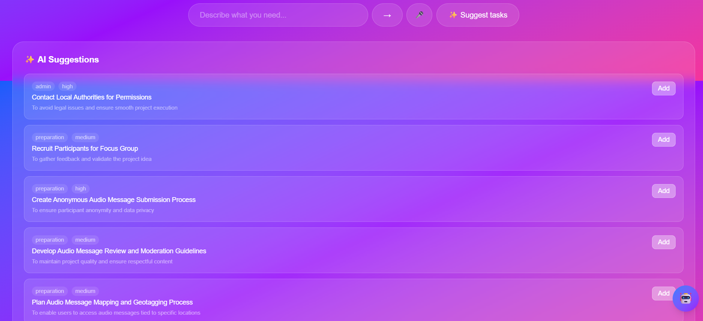
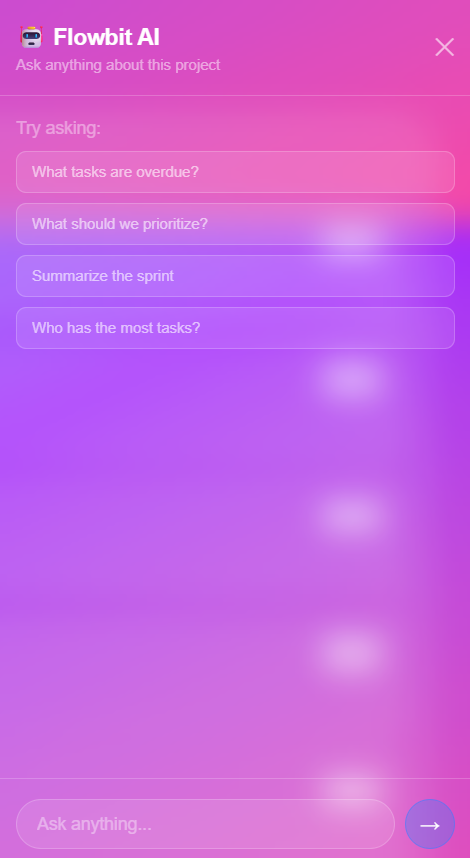
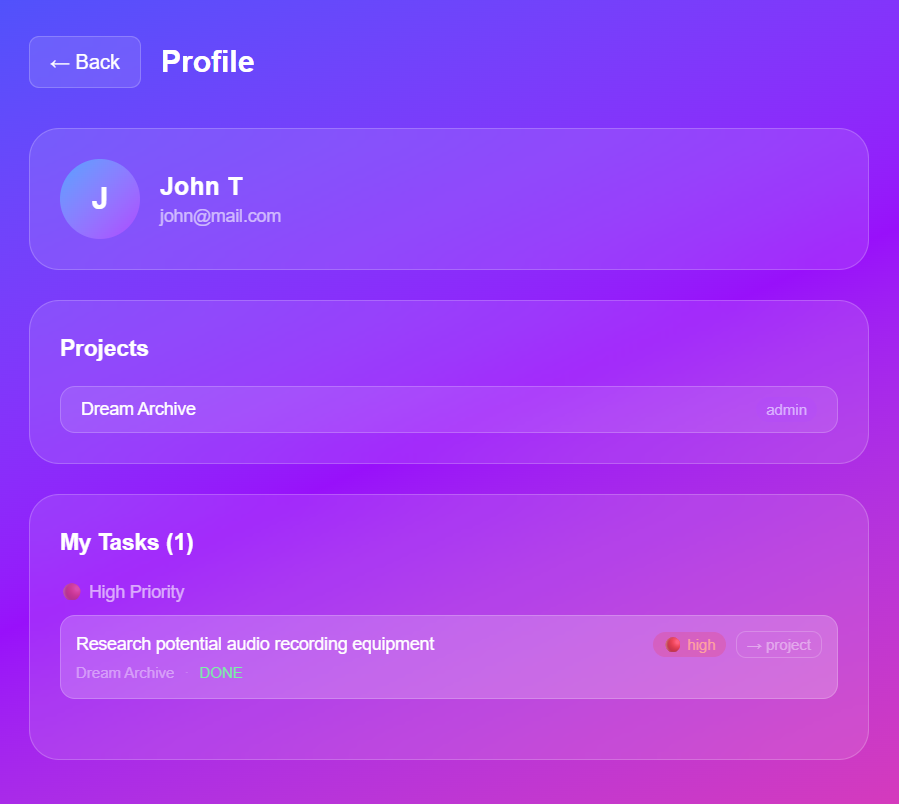

<div align="center">


# Flowbit

**An AI-powered project management app with real-time collaboration.**

Kanban boards that sync live across your team, plus AI that turns documents, voice, and plain English into structured tasks — and answers questions about your project.

[**Live demo →**](https://flowbit-iota.vercel.app)

</div>



---

## What it does

Flowbit is a task management app in the spirit of Linear and Jira, built to explore what happens when AI is woven through a real product rather than bolted on. You create projects, invite your team, and manage work on a drag-and-drop Kanban board that updates live for everyone connected. On top of that sits a layer of AI features that remove the busywork of creating and organizing tasks.

## Features

### Real-time Kanban board
Four columns — Backlog, In Progress, In Review, Done. Drag tasks between them and every connected teammate sees the change instantly over WebSockets. Updates are optimistic, so the UI never waits on the network.



Each task has a priority, due date with a live countdown, and an assignee. Tasks sort by priority automatically, with color-coded badges and overdue warnings.

### AI task creation, four ways
- **Suggestions** — the AI reads your project context and proposes relevant tasks.
- **Natural language** — type "add tasks for building a login system" and get structured tasks back.
- **Voice** — speak your task; the browser's Speech API transcribes and the AI creates it.
- **PDF upload** — drop in a meeting-notes or brief PDF and the AI extracts the action items.



### AI chat assistant
Ask questions about your project in plain language — "what's overdue?", "who has the most work?", "summarize the sprint" — and get grounded answers. The assistant reads live project data before responding and remembers the conversation, so follow-up questions work.



### ML priority prediction
When you create a task, a machine-learning model predicts its priority from the title and description. You can override it, and your corrections feed back into retraining the model.

### Team & profile
Role-based access (admin/member), invite and remove members, and a profile page showing every task assigned to you across all your projects.



---

## Architecture

Flowbit runs as several coordinated services rather than a single monolith, because different jobs have different needs.

```
                    ┌─────────────────────────┐
   Browser  ───────▶│  Next.js on Vercel      │  pages + REST API
                    └───────────┬─────────────┘
                                │
              ┌─────────────────┼──────────────────┐
              ▼                 ▼                  ▼
     ┌────────────────┐ ┌───────────────┐ ┌────────────────────┐
     │ Socket.io      │ │ FastAPI (ML)  │ │ PostgreSQL (Neon)  │
     │ on Render      │ │ on Render     │ │ + pgvector         │
     │ real-time sync │ │ priority pred.│ │ data + embeddings  │
     └────────────────┘ └───────────────┘ └────────────────────┘
```

- **Next.js on Vercel** serves the app and the main REST API.
- **A separate Socket.io server on Render** handles real-time updates, because Vercel's serverless functions can't hold persistent WebSocket connections.
- **A FastAPI service on Render** serves the Python ML model for priority prediction.
- **PostgreSQL on Neon** stores all data, with the pgvector extension enabled for embedding search.

---

## The AI/ML layer in depth

### RAG pipeline for PDF task extraction
Uploading a PDF runs a full retrieval-augmented-generation pipeline:

1. Extract text from the PDF.
2. Split it into ~500-word chunks.
3. Generate an embedding for each chunk with a HuggingFace sentence-transformer (`all-MiniLM-L6-v2`, 384 dimensions).
4. Store chunks and embeddings in PostgreSQL via pgvector.
5. Embed a query ("action items, tasks, todos") and retrieve the most similar chunks by cosine distance.
6. Send only those relevant chunks to Groq's Llama 3.3 to extract structured tasks.

This means a long document works just as well as a short one — the pipeline finds the parts that matter instead of dumping everything into the prompt.

### Intent-routed AI chat
The chat assistant avoids sending the entire project to the LLM on every message. Instead, a lightweight keyword router classifies the question ("overdue", "sprint summary", "workload"...) and runs a targeted database query for just that data. Only the relevant slice is passed to Groq, keeping responses fast, cheap, and accurate. Conversation history is persisted in PostgreSQL so context survives page reloads.

### Priority prediction model
A scikit-learn Random Forest classifier, trained on labeled task examples with TF-IDF features (including bigrams). It's served from a FastAPI endpoint that Next.js calls on task creation. When users correct a predicted priority, the correction is stored and folded into the next round of training — a simple feedback loop.

---

## Engineering decisions

- **Separate Socket.io server** — Vercel serverless can't maintain WebSocket connections, so real-time lives on its own Render service.
- **Separate FastAPI ML service** — keeps the Python ML stack isolated from the Node app and independently deployable.
- **pgvector over a dedicated vector DB** — reuses the Postgres already in the stack; no extra service to run or pay for at this scale.
- **Intent router instead of LLM-based routing** — a deterministic keyword router is faster, cheaper, and more reliable than asking an LLM to classify intent.
- **Optimistic UI updates** — the board updates instantly and reconciles with the server in the background, so drag-and-drop feels immediate.

---

## Tech stack

**Frontend** — Next.js, React, TypeScript, Tailwind CSS, TanStack Query, dnd-kit
**Backend** — Next.js API routes, Express + Socket.io, NextAuth, Prisma
**Database** — PostgreSQL (Neon) + pgvector
**AI / ML** — Groq (Llama 3.3), HuggingFace embeddings, Python, scikit-learn, FastAPI
**Infra** — Vercel, Neon, Render, Docker (local), GitHub Actions CI

---

## Running locally

**Prerequisites:** Node.js 20+, Docker Desktop, Python 3.10+

```bash
# 1. Clone and install
git clone https://github.com/anstrcloud-dev/collabboard.git
cd collabboard
npm install
pip install -r ml/requirements.txt

# 2. Environment — create a .env file
DATABASE_URL=your_postgresql_url
NEXTAUTH_SECRET=your_secret
NEXTAUTH_URL=http://localhost:3000
NEXT_PUBLIC_SOCKET_URL=http://localhost:3001
GROQ_API_KEY=your_groq_key
HUGGINGFACE_API_KEY=your_hf_key
ML_SERVICE_URL=http://localhost:8000

# 3. Start the database
docker-compose up -d

# 4. Run migrations and train the model
npx prisma migrate dev
py ml/train.py

# 5. Start all services (separate terminals)
npm run dev                                              # Next.js  :3000
cd socket-server && npx ts-node-dev --respawn src/index.ts   # Socket.io :3001
py -m uvicorn ml.api:app --reload --port 8000           # FastAPI   :8000
```

Open [http://localhost:3000](http://localhost:3000).

---

<div align="center">
Built by <a href="https://github.com/anstrcloud-dev">anstrcloud-dev</a>
</div>